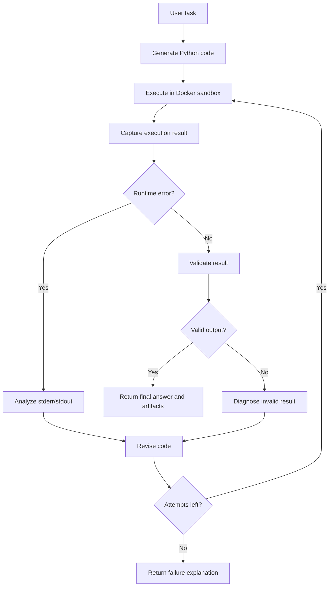
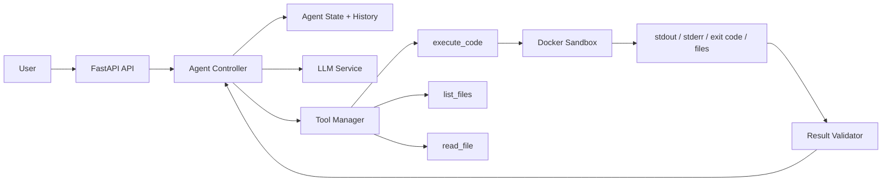

# Autonomous Coding Agent

A work-in-progress self-correcting Python execution agent that turns natural-language tasks into runnable code, executes that code inside an isolated Docker sandbox, observes failures, and retries with bounded self-correction.

The goal is to build a portfolio-grade agentic system that demonstrates practical LLM engineering: code generation, tool calling, secure execution, result validation, retry control, and execution history.

## What This Project Demonstrates

- Natural-language to Python code generation
- Controlled tool use instead of unrestricted model actions
- Docker-based execution for untrusted generated code
- Structured observation of stdout, stderr, exit code, and generated files
- Self-correction from runtime errors and failed validation checks
- Bounded retries with stopping conditions
- Result validation beyond "the script exited successfully"
- Execution history that makes the agent loop inspectable and debuggable

## Current Status

| Phase | Area | Status |
| --- | --- | --- |
| 1 | Repository scaffold + FastAPI backend | Done |
| 2 | Docker sandbox execution | Done |
| 3 | LLM code generation (Gemini) | Done |
| 4 | Result validation | In progress |
| 5 | Task queue + concurrent worker pool | Planned |
| 6 | Task state persistence (survives restarts) | Planned |
| 7 | Controlled tool set (execute_code, list_files, read_file) | Planned |
| 8 | Frontend demo | Planned |


## Evolving Toward a Task Scheduling System

Beyond phase 4, this project is expanding from a single-task agent loop into a small distributed task scheduler: a queue of jobs, a pool of workers executing sandboxed tasks concurrently, an explicit task state machine (`QUEUED → RUNNING → SUCCEEDED/FAILED → RETRYING`), and persisted state so runs survive a restart. The retry/timeout/resource-limit work from phases 1–3 already covers a meaningful part of this.


## Core Agent Loop



## Planned Architecture



## Target Sandbox Constraints

The sandbox is designed around explicit limits so generated code is treated as untrusted by default.

| Constraint | Target Value |
| --- | --- |
| Max execution time | 30 seconds |
| Memory limit | 512 MB |
| CPU limit | 1 CPU |
| Max retry attempts | 3 |
| Filesystem access | Temporary workspace only |
| Network access | Disabled by default; restricted mode for approved web tasks |
| Package strategy | Preinstalled safe data stack for V1 |

Planned V1 sandbox packages:

- `python`
- `requests`
- `beautifulsoup4`
- `pandas`
- `numpy`
- `matplotlib`

Build the sandbox image:

```bash
docker build -f docker-build/sandbox.Dockerfile -t coding-agent-sandbox .
```

Run the Phase 2 integration tests after Docker is available and the image is built:

```bash
pytest tests/test_sandbox_integration.py
```

## Agent State Model

The agent will maintain structured state for every run so each decision is traceable.

```python
class AgentState:
    task: str
    code: str | None
    attempt: int
    max_attempts: int
    stdout: str
    stderr: str
    exit_code: int | None
    generated_files: list[str]
    status: str
    history: list[dict]
```

Example execution history:

```json
[
  {
    "attempt": 1,
    "exit_code": 1,
    "error": "KeyError: 'prices'",
    "action": "Revise column selection and retry"
  },
  {
    "attempt": 2,
    "exit_code": 0,
    "files": ["summary.csv", "chart.png"],
    "action": "Validate generated artifacts"
  }
]
```

## Validation Strategy

The project will validate both execution success and task success.

Examples:

- Did the script exit with code `0`?
- Did it create the expected output file?
- Is the generated CSV non-empty?
- Does the chart image exist?
- Did the result include at least one extracted row?
- Did the same error repeat across attempts?

This avoids treating a silent failure, empty CSV, or missing chart as success.

## Stopping Conditions

The agent will stop when one of these conditions is met:

- Validation succeeds.
- Maximum attempts are reached.
- Execution times out.
- The same error signature repeats.
- The generated code stops making meaningful progress.
- The requested task violates sandbox or safety constraints.

## Planned API Shape

```http
POST /runs
Content-Type: application/json

{
  "task": "Read sales.csv and create a monthly revenue chart",
  "max_attempts": 3
}
```

Planned response:

```json
{
  "run_id": "run_001",
  "status": "success",
  "attempts": 2,
  "artifacts": ["monthly_revenue.csv", "monthly_revenue.png"],
  "history": [
    {
      "attempt": 1,
      "status": "failed",
      "stderr": "KeyError: 'revenue'"
    },
    {
      "attempt": 2,
      "status": "validated",
      "stdout": "Generated monthly_revenue.csv and monthly_revenue.png"
    }
  ]
}
```

## Demo Scenarios

The project will start with small deterministic tasks before moving into web/data workflows.

| Scenario | Purpose |
| --- | --- |
| Calculate an average from a list | Validate basic code generation and execution |
| Analyze a CSV with a wrong column assumption | Demonstrate error observation and self-correction |
| Generate a chart from tabular data | Demonstrate artifact creation and validation |
| Extract product data from an allowed demo page | Demonstrate restricted web/data workflow |

## Evaluation Metrics

Planned metrics for measuring the agent:

- Task success rate across a small benchmark set
- Average attempts per successful task
- Retry recovery rate after first-attempt failure
- Timeout/failure rate
- Percentage of failures with useful explanations
- Artifact validation pass rate

Example target goals for V1:

| Metric | Target |
| --- | --- |
| Simple Python task success rate | 90%+ |
| CSV/chart task success rate | 75%+ |
| Max attempts per run | 3 |
| Median sandbox runtime | Under 10 seconds |
| Failed runs with clear explanation | 100% |

## Roadmap

### Phase 1: Basic Code Generation

- Accept a natural-language task.
- Generate Python code using an LLM.
- Return the generated code without executing it.

### Phase 2: Docker Sandbox

- Execute generated Python code in an isolated container.
- Capture stdout, stderr, exit code, and generated files.
- Apply timeout, memory, CPU, and filesystem constraints.

### Phase 3: Agent Loop

- Implement generate, execute, observe, fix, and retry.
- Maintain structured execution history.
- Add repeated-error detection.

### Phase 4: Validation

- Validate that outputs satisfy the task.
- Distinguish runtime success from logical success.
- Return clear failure explanations.

### Phase 5: Tool Interface

- Add controlled tools for Python execution and file inspection.
- Keep the LLM behind explicit application-owned tool boundaries.

### Phase 6: Data and Web Tasks

- Support CSV analysis and chart generation.
- Add restricted web-fetching workflows for permitted pages.

### Phase 7: Demo UI

- Build a frontend showing task input, attempts, errors, fixes, and final artifacts.
- Display generated charts and downloadable files.

## Current Project Structure

```text
.
- app/
  - main.py
  - config.py
  - agent/
    - controller.py
    - state.py
  - api/
    - routes.py
  - sandbox/
    - executor.py
  - tools/
    - manager.py
- tests/
  - test_state.py
- requirements.txt
- docker/
  - sandbox.Dockerfile
- README.md
- LICENSE
- .gitignore
```

## Tech Stack

| Component | Technology |
| --- | --- |
| Backend | Python, FastAPI |
| Agent loop | Python state machine |
| LLM integration | OpenAI or compatible LLM API |
| Sandbox | Docker |
| Data workflows | pandas, matplotlib |
| Testing | pytest |
| Frontend | React or lightweight HTML UI |
